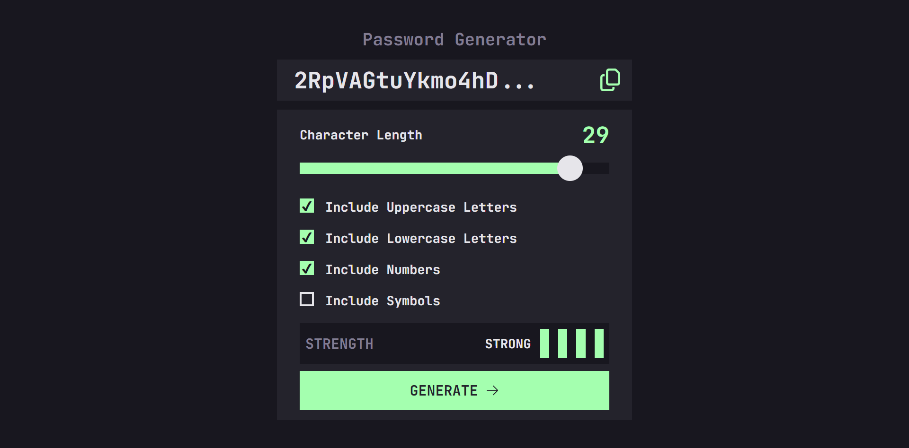
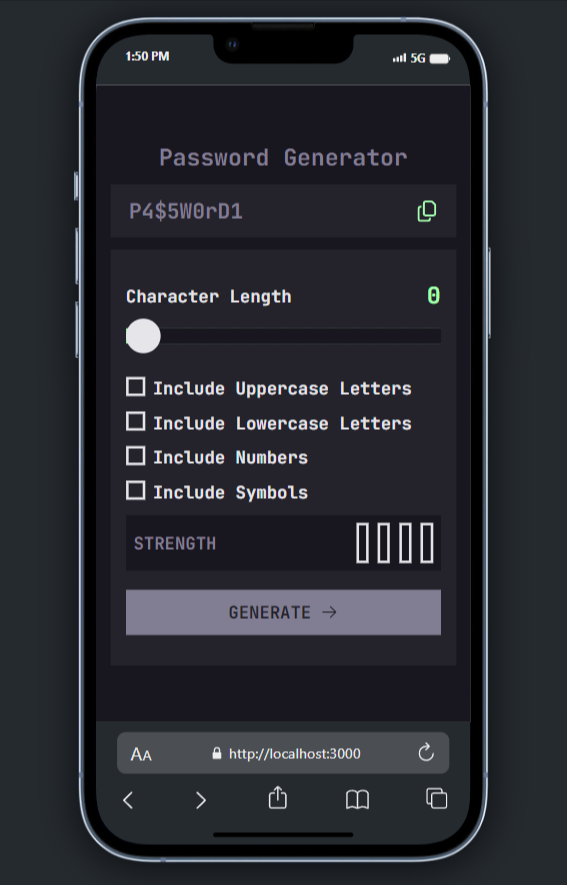
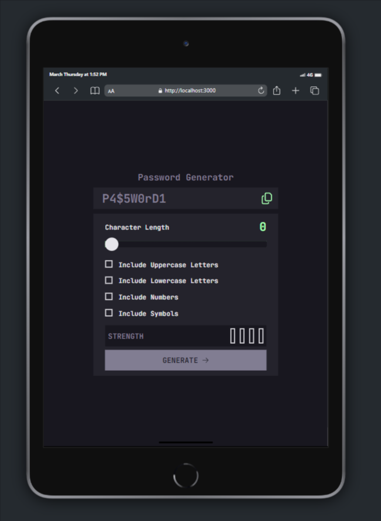

# Password Generator App Solution

This is a solution to the Password Generator App coding project Provided to me by [Amalitech](https://amalitech.org).

## Table of Contents

- [Overview](#overview)
  - [The Challenge](#the-challenge)
  - [Screenshot](#screenshot)
  - [Links](#links)
- [My Process](#my-process)
  - [Built With](#built-with)
  - [What I Learned](#what-i-learned)
  - [Continued Development](#continued-development)
  - [Useful Resources](#useful-resources)
- [Author](#author)
- [Acknowledgments](#acknowledgments)

## Overview

### The Challenge

Users should be able to:

- Generate a password based on the selected inclusion options
- Copy the generated password to the computer's clipboard
- See a strength rating for their generated password
- View the optimal layout for the interface depending on their device's screen size
- See hover and focus states for all interactive elements on the page

### Screenshot





### Links

- Solution URL: [View Source Code](https://github.com/ellaboevans/Password-Generator-App)
- Live Site URL: [View Live Site](https://evans-password-generator.vercel.app)

## My Process

### Built With

- [React](https://reactjs.org/) - JS library
- [Vite](https://vitejs.dev/) - For build and development
- [Styled Components](https://styled-components.com/) - For styles
- [Zustand](https://github.com/pmndrs/zustand) - For State Management
- [Vercel](https://vercel.com) - For deployment

### Actions (Interactivity)

- Generate Password
- Copy Password to Computer's Clipboard
- Password Strength Check
- Enable/Disable Uppercase Letters
- Enable/Disable Lowercase Letters
- Enable/Disable Numbers
- Enable/Disable Symbols
- Adjust Password Length
- Disabled Generate Password Button when password length is 0

### What I Learned

During this project, I learned how to efficiently manage state using Zustand, which improved the performance of the app. I also gained more experience in styling with Styled Components, ensuring a responsive layout for various screen sizes.

```js
// Generate Password Snippet
generatePassword: () => {
  const {
    isUppercase,
    isLowercase,
    includeNumbers,
    includeSymbols,
    sliderValue = MIN_PASSWORD_LENGTH,
  } = get();

  try {
    set({ isLoading: true });

    const generatedPassword = generatePassword(
      sliderValue,
      isUppercase,
      isLowercase,
      includeNumbers,
      includeSymbols
    );

    set({ password: generatedPassword });
    const strength = get().validatePasswordStrength(generatedPassword);
    set({ strengthValue: strength });
  } catch (error) {
    if (error instanceof Error) {
      console.log(error.message);
    }
  } finally {
    set({ isLoading: false });
  }
};

// Copy Password to Computer's Clipboard Snippet
setCopyToClipboard: () => {
  const { password } = get();
  if (navigator.clipboard) {
    navigator.clipboard.writeText(password);
    set({ isLoading: true });
    setTimeout(() => {
      set({ isLoading: false });
    }, 3000);
  }
};

// Password Strength Check Snippet
validatePasswordStrength: (password) => {
  let strength = 0;

  // Check length
  if (password.length >= 8) strength++;

  // Check for lowercase letters
  if (/[a-z]/.test(password)) strength++;

  // Check for uppercase letters
  if (/[A-Z]/.test(password)) strength++;

  // Check for numbers
  if (/\d/.test(password)) strength++;

  // Check for special characters
  if (/\W/.test(password)) strength++;

  return strength;
};

// Navigate to src/store/store.ts for more info.
```

## Continued Development

In future projects, I plan to explore more advanced state management techniques and focus on improving accessibility features within my applications.

## Useful Resources

- [Zustand Documentation](https://github.com/pmndrs/zustand) - Comprehensive guide to using Zustand for state management.
- [Styled Components Docs](https://styled-components.com/docs) - Useful documentation for creating styled components.

## Author

- GitHub - [Evans Elabo](https://github.com/ellaboevans)
- Twitter - [@dev_concept](https://www.twitter.com/dev_concept)

## Acknowledgments

I would like to thank the Recruitment Team at [AmaliTech](http://amalitech.org) for providing such a challenging and rewarding coding project.
